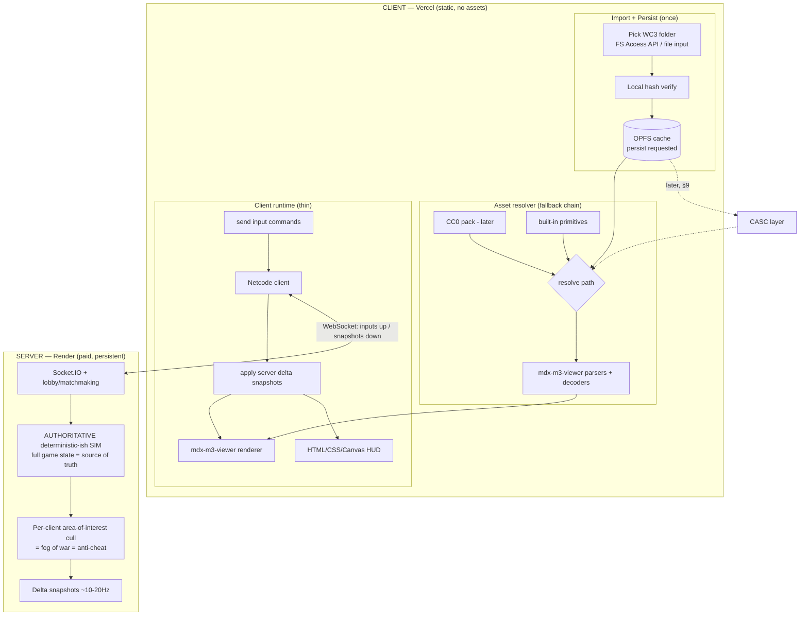

# OpenWar3 — Build Plan

A browser-first, asset-compatible re-creation of the Warcraft III engine, in **TypeScript**.
**Base version: 1.27a**, **The Frozen Throne first** (Reign of Chaos supported later as a content
profile, not a fork). Players supply their own legally-owned game files; **OpenWar3 ships and hosts no
Blizzard assets** — and is **playable with zero assets** via placeholders (see §2). The UI is a
**faithful, asset-driven recreation** of the original menus and HUD (see §10).

> **Status: finalized — ready for Claude Code.** Start at **Phase 0 (§6)**. The canonical main-menu
> reference and the FDF-usage approval are in **§10**.

---

## Progress snapshot (2026-07-02)

Repo: `elevchyt/openwar3` (private). Package manager: **pnpm**. Renderer: mdx-m3-viewer 5.12.0,
patched via `pnpm patch` (`patches/mdx-m3-viewer@5.12.0.patch`) — see notes below.

**Done:**
- **Real-data stats + mine/rally/cancel pass (2026-07-02, latest+11)** — **inspected the real MPQs**
  (`Warcraft III/`) and fixed unit stats: heroes were 100 HP because the loader used the raw `hp`
  field — now uses the game's precomputed `realhp`/`realm`/`realdef` and adds the **primary
  attribute** to hero attack (Paladin: 650 HP, 255 mana, 24–34 dmg, all matching the reference).
  Command tooltips now use the real **Ubertip** descriptions (colour codes stripped). **Gold mines
  are selectable** (click → shows remaining gold in the info panel, sized ground ring, mine
  portrait). **Rally points**: a "Set Rally Point" button on unit-producing buildings + right-click,
  and a persistent **rally flag** (`UI\Feedback\RallyPoint\RallyPoint.mdx`) at the selected
  building's rally. **Cancel construction** now actually works — refunds cost, unstamps the pathing
  footprint, and removes the building with a death/collapse event (building models ship only a
  "Death" clip, used for both cancel and combat destruction). **Selection pick reworked to a hybrid**
  (screen projection gated by world distance) so tall **buildings are clickable again** (the green
  ring is back) while the zoomed-out distant-creep bug stays fixed. **Order flashes size to their
  target again** (the yellow gold-mine ring), selection rings stay constant. Worker **Build** button
  moved to bottom-left. Added the [[use-mpq-game-data]] memory. 27 headless sim checks pass; build
  clean. (User also made manual HUD CSS tweaks — preserved.)
- **Orders/selection/rally pass (2026-07-02, latest+10)** — used the real MPQs in
  `Warcraft III/` to verify data (via a throwaway MPQ-reader script): every building has
  `Birth`[0,60000] then `Stand`, and start-location props are `Objects\StartLocation\
  StartLocation.mdx` hard-coded with an **undefined row** — so the ghost now scrubs Birth→end
  (fully built) and start markers are hidden by matching **rowless** rendered units once
  `unitsReady` (the old `sloc` id check found nothing). **Selection rewritten to a ground-point
  pick** (nearest unit to the click's world ground point) — fixes far-away creeps being selected
  when zoomed out (screen projection mis-fired / picked behind-camera units). **No click-to-
  deselect**: clicking empty ground / an empty drag-box keeps the current selection. **Rally
  points**: right-clicking with a building selected sets where trained units complete (verified).
  **Attack-move / patrol / skills show a crosshair cursor** (armed override on the forced WC3
  cursor). **Command card** reordered to the developer's spec (top row Move/Stop/Hold/Attack,
  Patrol at (0,1), Build at (3,1), bottom row reserved for hero skills). **Workers face the
  building** while constructing (was swinging at the air). **Right-clicking an unreachable tree**
  now harvests the nearest reachable tree where the worker ends up. Removed the full-width black
  console backing (looked bad); tooltip nudged up ~1/3. Docs: added the classic.battle.net basics
  reference. 22 headless sim checks pass; build clean.
- **HUD/ghost bugfix pass (2026-07-02, latest+9)** — fixed the info panel showing a stale
  "Constructing"/"Training" for units and after deselect: `.hud-progress-wrap`/`.hud-queue` used
  `display:flex`, which beat the `hidden` attribute → added a global `[hidden]{display:none
  !important}` and force a text refresh the frame the selection id changes. **Command icons now
  fill the slot** — the skinned-slot `background:` shorthand (higher specificity) was resetting
  `background-size`; made `.hud-cmd` `100% 100% !important`. Added a full-width opaque **console
  backing** so grass no longer shows through the art's gaps/letterbox (also blocks map clicks in
  the HUD band). **Build ghost** now scrubs the **Birth clip to its last frame** (fully-built) —
  "Stand" left birth-revealed geosets hidden, so most silhouettes looked half-built (Altar of Kings
  happened to work). **Start-location (`sloc`) markers hidden** after melee init. **Click colliders**
  widened (≥64-unit radius, ≥ the drawn circle) with the body capsule capped so tall buildings don't
  grab sky clicks.
- **HUD info-panel + tooltip pass (2026-07-02, latest+8)** — the selection info panel now matches
  the WC3 reference screenshots (`~/Downloads/2026-07-02 17_45*.png`): **construction** shows the
  building icon + "Constructing" + a gold progress bar; **training** shows "Training" + the current
  unit's icon + a progress bar + the **queue slots** (positions 2–7, filled with unit icons or the
  slot number); units keep the damage/armor lines. Data flows from the sim (`buildProgress`,
  `trainProgress`, `queue` icons) through `SelectionInfo`→`HudSelection`; a new `driver.blpUrl(path)`
  resolves arbitrary BLP icons. **Command tooltips** restyled to the reference (translucent
  blue-grey slab, white title with the **hotkey letter in gold**, "Build " prefix for build
  orders) and now use the **real gold/lumber/food BLP icons** (the same ones as the top resource
  bar) instead of placeholder ◈/❦ glyphs. Still TODO: hero Str/Agi/Int attributes + damage/armor
  stat icons in the panel.
- **Orders/feedback/camera pass (2026-07-02, latest+7)** — **Patrol** + **attack-move** orders
  (sim `patrol`/`attackmove`: patrol bounces between two points, a-move engages enemies acquired en
  route; both verified headlessly). **3D order-feedback arrows** at the destination —
  `UI\Feedback\Confirmation\Confirmation.mdx` tinted **green** for move/patrol, **red** for
  attack-move (path confirmed via Warsmash + the stock `SharedMelee.pld` preload). **WC3 cursor
  forced everywhere in-game** (injected `body.in-game *` rule with `!important`) — no more
  pointer/crosshair. **Bigger click colliders:** picking is now a vertical **capsule** from the
  unit's feet up over its body (using the full selection radius, not half), with units preferred
  over buildings — fixes "hard to click". **Camera zoom clamped** to a WC3-like range (1500–3600)
  and melee opens a touch more zoomed out (2400). **Indicator circles** now draw at a **constant
  size/thickness** (was scaling with the unit) and sit a hair off the ground. **Command card**:
  icons `background-size:100% 100%` (no crop), added **Patrol**, WC3-authentic bottom-row order
  layout. Birth animation already freezes with construction (renderer scrubs it to progress). 20
  headless sim checks green; `npm run build` clean.
- **Combat/selection/data pass (2026-07-02, latest+6)** — **projectiles**: ranged weapons
  (`weapTp1` = missile/artillery, or a `Missileart`) now launch a homing missile model that travels
  and deals its pre-rolled damage on *impact* (armor applied then), fizzling if the target dies
  mid-flight; melee stays instant. Sim owns `projectiles`; the renderer loads+moves the
  `Missileart` MDX and `detach()`es it on landing (mdx-m3-viewer has no missile system — we drive
  it). **Multi-unit selection:** left-drag draws a green marquee that selects the local player's
  mobile units; the controller holds a selection `Set` + a `primary` leader (drives HUD/portrait/
  command card); move/attack/stop/harvest/resume-build orders apply to the whole group; a
  selection-circle pool rings each member. **Always-on health bars** float over every visible unit
  (pooled DOM), replacing the selected/hovered-only bars. **Enemy circles are red:** ring colour is
  now by alliance (own+ally = green, everyone else incl. neutral-hostile = red); right-click-attack
  flashes a **red** ground ring at the target (twin-blink, like the yellow harvest flash).
  **Yellow/all flash+selection circles hug the ground** at any size (the ring model's vertical
  offset scales with the circle, so big mine-sized rings no longer float). **Tech-tree data fixed:**
  the curated build/train table had the barracks training Mortar Teams and the NE Ancient of War
  as the hero altar — rewrote all four races' rosters against verified rawcodes (Human Workshop
  `harm`; Orc Raider at Beastiary; NE altar `eate`), see docs/REFERENCES.md. **Build-ghost:** the
  placement silhouette now faces south and plays its finished "Stand" clip (was showing the default
  first sequence — often the "Birth" scaffold, the "preview/wrong-rotation" look). **Construction
  pause/resume** re-verified headlessly (freezes when the worker leaves, resumes — walking back if
  far — when reassigned). *Deferred:* true animation-blend cross-fades (mdx-m3-viewer plays
  sequences as hard cuts; adding blending means patching its per-frame `updateNodes` node-pose
  path — large blast radius, needs in-browser verification); build-ghost translucency (vertex-alpha
  is ignored on opaque building geosets — the ghost is solid-tinted). All sim logic verified via a
  headless esbuild script (15 checks: projectiles, melee, construction pause/resume); `npm run
  build` clean.
- **Phase 0** — Vite+TS scaffold, asset resolver (install→CC0→primitive), OPFS import, menu shell.
- **Phase 1** — layered MPQ VFS + content profiles (TFT default). Import a WC3 folder, read any file.
- **Phase 2** — placeholder heightmap terrain + fly camera (zero-asset fallback).
- **Phase 3** — animated MDX unit rendering (dedicated `#model` canvas).
- **Authentic maps** — `War3MapViewer` renders real terrain/textures/cliffs/water/doodads/units.
- **Phase 4** — unit data registry (`src/data/units.ts`): merges the unit SLKs → 836 units.
- **Phase 5 (vertical slice)** — our own headless sim (`src/sim/`): pathing grid (war3map.wpm +
  stamped destructible/building footprints), A* move orders, unit movement with turn rate, circle
  collision between ground units; air units ignore the grid and hold a fixed altitude; selection +
  right-click move via `src/game/rts.ts`. Real unit stats (speed/collision/turnrate/moveheight).
- **Phase 5.5** — game-setup **lobby** (`src/ui/lobby.ts`: per-slot controller/race/team) and
  **melee init** (`mapViewer.startMelee`): spawns each race's starting units (hall + workers) at the
  map's start locations, controllable.
- **Polish pass (2026-07-02)** — cliff **ramps**: mdx-m3-viewer never implemented them; our patch
  now ports HiveWE's algorithm (2-tile `CliffTrans`/`CityCliffTrans` models from
  CliffTypes.slk `rampModelDir`, corner letters L/H + X/H for 2-layer ramps in cliffFileName's
  BL,TL,TR,BR span order, entrance tiles render sloped ground with base corners +0.5 layer; model
  anchors verified from geoset extents: bottom-right corner, vertical ramps extend north, horizontal
  west ⇒ horizontal anchor at (x+2)·128). Names validated: every ramp generated on LostTemple /
  PlunderIsle / Duskwood exists in War3.mpq. Host injects `viewer.terrainModelExists`. Our height
  sampler applies the same entrance bump (`rampAdjust`) so units walk the slope. Sim: units **never
  push** stationary units (WC3 rule) — movers get shoved back, give up after 0.5 s blocked
  (`stuckT`); moving pairs split the correction plus a tangential slide (head-on deadlock fix);
  turning decoupled from movement (`desiredFacing`, finishes after arrival). UI: hover ring +
  HP bar (selection too), air units picked/marked at altitude (moveHeight + 60 lift), metrics
  overlay (fps / frame ms / unit count / ping placeholder) bottom-left.
- **Polish pass 2 (2026-07-02, afternoon)** — **tileset fidelity:** cliff textures are
  tileset-prefixed in the MPQs (`W_Cliff0.blp` on winter maps; SLK only says `Cliff0`) — our solver
  now remaps using the viewer's solverParams.tileset + existence check; destructible trees override
  their model's replaceable texture per row (`texID`/`texFile` — one LordaeronTree model shows
  summer/fall/snow/winter canopies; patch adds per-instance `setTexture`). **Turn rate** now
  authentic (hive thread 129619): editor value = rad per 0.03 s frame, capped 0.2 rad/frame.
  **Unit-aware pathing:** A* takes an occupancy blocker (stationary ground units, Minkowski-expanded
  by mover radius; cells adjacent to start stay open so overlapping units can leave), is best-effort
  (walks as close as possible, WC3-style), search capped at 8192 expansions; a boxed-in unit stands
  still and only turns to face the ordered point (≤2 stuck-repath attempts). **Selection ring**
  zoom-agnostic: world-space radius = `selScale` (unitUI `scale`) × 36, projected to screen px per
  frame as a ground-plane ellipse; HP bar scales with it. **Font:** Nowar Sans bundled
  (`public/fonts/`, OFL) with Friz Quadrata preferred if installed (§10.1b). `docs/REFERENCES.md`
  lists reference projects + the "search Hive Workshop for mechanics" guideline.
- **Grid-reservation pathing + in-game HUD (2026-07-02, evening)** — pathing is now WC3-true
  (hive tutorial 154558 + surround mechanics): stationary units **reserve n×n cells** on the
  32-unit pathing grid (collision 0–15→1×1, 16–31→2×2, 32–47→3×3, 48+→4×4); stopping units snap to
  footprint alignment (odd→cell centre, even→cell corner); movers need their own footprint's
  clearance at every A* node; reservations release while moving and on death. Surrounds work by
  construction. Best-effort arrivals retry once if the ordered goal's cells free up mid-walk.
  Buildings snap to the grid before their pathTex stamp (`snapForFootprintRect`). **In-game HUD v1**
  (`src/ui/hud.ts`, per §10.1b): top bar (menu placeholders, clock placeholder, gold/lumber/food with
  real BLP tooltip icons + WC3 upkeep brackets), bottom console (real `war3mapMap.blp` minimap with
  live player-colored unit dots + click-to-pan, portrait/info panel with selected unit name + HP,
  inventory placeholder, 4×3 command card with Move/Stop/Attack — M/S/A hotkeys, Esc cancels,
  armed order consumes the next left-click). Melee start stash 500 g / 150 w; food live from owned
  units. In-game camera pans with arrow keys (WASD reserved for hotkeys); `src/render/blputil.ts`
  decodes BLPs for DOM use. Next: resource gathering loop (gold/lumber/train) driving these numbers.
- **Gather polish + carry anims + HUD tweaks (2026-07-02, latest+1)** — fixed workers getting
  **stuck after depositing gold**: the town hall's collision (176) was used as a Euclidean deposit
  radius, unreachable given its ~512 footprint, so returns looped forever. Deposits now happen on
  **arrival** (nearest reachable point to the depot via the shared `arriveAtNode` latch), same
  contract as harvesting — verified: 17 deposits/120 s, no stall. **Carry animations:** the
  controller resolves per-unit `AnimSet`s (`buildAnimSet`) and `pickSequence` plays Walk/Stand Gold,
  Walk/Stand Lumber, and Attack Lumber (chop) from the real peasant/peon clips, falling back to base
  clips for units without them. **HUD:** resources/food/upkeep pushed to the far right
  (`margin-left:auto`), day/night medallion enlarged (300% of bar height), top menu buttons restyled
  as beveled WC3-ish stone (real `UpperMenuButtonTexture` is an FDF-decorated indirect name — full
  FDF-driven top bar deferred to the §10 UI pass).
- **Feedback pass 2 (2026-07-02, latest+5)** — build **silhouette ghost**: placing a structure now
  shows the translucent building model (blue tint = valid, red = blocked) following the cursor on the
  ground, not just the green/red box (kept as a pre-load fallback). Buildings play their real
  **Birth** construction animation scrubbed to the timer; the worker **snaps to the nearest free
  tile** when construction starts (no longer trapped inside). Selection/hover rings **hug the ground**
  (z sampled each frame), and the yellow harvest flash is a matching flat ground ring. Command card
  got a solid dark backing + dark slots (no terrain showing through) with icons contained in-tile.
  **Top bar** restyled toward the reference (dark stone strip, beveled tan-bordered menu buttons,
  rounder resource icons). **Still deferred:** per-tile green/red build grid + auto-move-out of
  friendly units; true model translucency depends on material blend (vertex-alpha only).
- **Feedback pass (2026-07-02, latest+4)** — command card was empty because `.hud-command`'s
  `position:relative` (for its tooltip) overrode the zone's `position:absolute` — `place()` now sets
  position inline. Info panel + HP/mana plates are **solid black, always present**. Day/night clock
  cropped **square** so the sun/moon disc is a true circle (no warp). Removed **left-drag camera
  rotation** (fixed WC3 angle). **Collider-based selection:** picks by each unit's collision radius
  projected to screen (buildings selectable on their body, not just centre). **Worker-driven
  construction:** placing a structure now sends the worker to the site and the building rises **only
  on arrival** (no instant spawn), scaling 40%→full over the build time while the worker plays its
  build anim; progress **halts if the worker leaves** (any manual order) and resumes on right-click;
  verified headlessly. **Selection circles are now flat 3D models** on the terrain
  (`UI\Feedback\selectioncircle\selectioncircle.mdx`, Friendly/Enemy/Neutral seqs, scaled by
  selScale) so geometry occludes the far side — the DOM ring is retired (HP bar stays as a DOM
  overlay). **Deferred (needs a focused 3D pass):** the WC3 build-placement ghost as a translucent
  building silhouette + per-tile green/red ground grid with auto-move-out — we still use the simpler
  green/red cursor box for now.
- **Phase 6 — building & training (2026-07-02, latest+3)** — the economy loop is now a game:
  registry loads command-card **icons** (`art`) + grid positions (`buttonpos`) from the per-race
  `UnitFunc.txt`; a curated melee **tech tree** (`src/data/techtree.ts`) maps each race's worker →
  buildable structures and each structure → trainable units. Sim gained **building state**:
  construction ramps HP 10%→full over the build time (blocks training until done) and a **training
  queue** that emits completion events. **Dynamic command card** (`mapViewer.commandCard`/`runCommand`)
  swaps per selection — worker: Move/Stop/Hold/Attack + Build (opens the structure sub-page); building:
  its train list; under-construction: Cancel — with real BTN icons, hotkeys, and cost/description
  tooltips; unaffordable buttons dim. **Build placement:** click a structure → cursor ghost (green/red
  by footprint validity) → click to place (charges gold/lumber, spawns it under-construction, sends the
  worker); right-click/Esc cancels. **Training:** deducts on queue, spawns the finished unit at the
  building's rally point; Cancel refunds the last queued unit. Sim construction/training verified
  headlessly; registry icons + tech-tree resolution verified against the real MPQs. Simplifications:
  building appears at placement (not on worker-arrival), worker isn't consumed, no tier requirements,
  no rally-point UI yet.
- **Mining behaviour + HUD polish + day/night (2026-07-02, latest+2)** — **mining:** resources
  return to the *nearest* edge of the depot (worker paths to the building's near side), workers
  **ghost through each other** for the whole auto gold loop (`noCollision`, cleared by any manual
  order), entering a mine force-deselects the worker, and a **yellow ring flashes twice** at a
  tree/mine on a harvest order (sized to the node). **HUD:** selected-unit detail panel has a dark
  backdrop with name + damage/armor; HP/mana are readable coloured numbers; **portrait click** snaps
  the camera to the unit and **hold** locks it; command card uses real **BTN\* icons** + hover
  tooltips (name/hotkey/description). **Day/night cycle** in the sim (480 s = 24 game-h, day
  06:00–18:00, melee starts 08:00; `SimWorld.timeOfDay`/`isDay`) drives the clock's real sun/moon
  time-indicator disc (sun by day, moon by night). **Race-specific HUD** confirmed (console skin,
  time indicator, and now the **cursor** all follow the client's resolved race). Reference
  screenshots at `~/Downloads/references/` (see [[hud-reference-screenshots]]).
- **HUD v4 + gather rework (2026-07-02, latest)** — console no longer stretches: it's rendered at
  its **natural aspect** (`aspect-ratio` + `min(26vh, 100vw/aspect)`), centred, letterboxed on
  widescreen (matches the reference). Day/night clock is now its own centred medallion crop
  (x 44.4%–55.6%, y 0–20.5% of the atlas) so it's not cut off. Portrait shows HP/mana as coloured
  **numbers only** (no bars). Skinned command/inventory slots are transparent so the art's own frames
  show. **Gathering reworked** to fix the jitter/early-mine bugs: a worker paths toward its node
  **once** at order time (`pathToNode`), then `arriveAtNode` just waits for arrival and parks in
  place (settle without the grid-snap) — no per-tick re-pathing, so no jiggle; mines are entered only
  once the pathfinder can't get closer (at the blocked footprint edge), never early. Verified
  headlessly against stamped tree walls + a 12×12 mine footprint (60 lumber/90 s steady, diagonal
  mine entry at the wall).
- **HUD v3 + gather fixes (2026-07-02, late)** — the console UITiles are a texture ATLAS (top
  ~55 px = resource-bar chrome with clock socket; y≈160–512 = console with minimap frame, portrait
  arch, inventory, command card) — verified by rendering the atlas to PNG and inspecting it. HUD
  crops both pieces, skins the top bar, and absolutely positions its five zones over the art's
  measured sockets (`ZONES` in hud.ts; FDF parsing later for exactness). Portraits use the model's
  built-in camera (real close-up) and the owner's team color (12 = neutral black). Camera starts at
  gameplay zoom (2600; 1750 centered on the local base at melee start). Gathering fixes: tree chop
  reach 72 (32 was unreachable past blocked cells + mover clearance — the "lumber doesn't work"
  bug), work-state hysteresis kills animation flapping, mine entry measured to the square footprint
  edge (Chebyshev — the circular test fired early on diagonals), bigger resource click radii. All
  verified headlessly against stamped footprints.
- **Economy + HUD v2 (2026-07-02, night)** — **resource gathering** (community-verified numbers,
  docs/REFERENCES.md): sim owns mines (from `war3mapUnits.doo` `ngol` + its real goldAmount) and
  trees (destructibles with `targType=tree`; 50 lumber each). Workers (`WORKERS` in
  `src/data/races.ts`): peasant/peon 10 gold/trip with 1 s inside the mine (one at a time,
  queueing), 1 lumber per 1 s chop cap 10; ghoul 20 cap / 2 per chop; wisp 5-per-5 s without tree
  damage; acolyte gold-only. Deposits at halls (`DEPOT_IDS`; lumber mill lumber-only) into per-player
  sim stashes (melee init 500 g/150 w); auto return-to-node loop; right-click on a mine/tree =
  smart harvest order; felled trees/depleted mines fire events → renderer hides the widget and
  unstamps its footprint cells (grid.unblock). Workers hide inside mines, chop with attack anim,
  carry shown in HUD. **HUD v2:** canonical names from `Units\*UnitStrings.txt`; animated 3D
  portrait (own mini-viewer rendering `<model>_Portrait.mdx`, fallback to the unit model) with
  HP/mana bars + numeric values beneath; real race console skin (stitched `UI\Console\<Race>\
  <Race>UITile01–04.blp`, cropped to opaque chrome); main-menu panel hidden in-game
  (body.in-game). Collision now also read from UnitData.slk (1.27 keeps it there in the RoC base
  layer) so unit cell footprints are real. Known gaps: portrait uses bounds-framing (not the model's
  own Portrait camera); console zone alignment approximate (FDF later); NE/UD mining is classic-
  style (entangle/haunt later); no carry-visual on worker models.
  same team; creeps = team −1, hostile to players but not each other), HP/armor, weapons from
  UnitWeapons.slk (base + dice damage, cooldown, range, acquire), attack orders with chase/repath,
  facing gate before swings, WC3 armor reduction (6%/point), idle auto-acquisition (0.5 s scans),
  return-fire retaliation, death events; deterministic seeded RNG for damage dice. Controller
  (`src/game/rts.ts`): right-click a hostile unit → attack order (ground → move), attack/death
  animations, corpses hidden after 3 s, HP bar on the selection marker. Melee spawns carry
  slot owner/team; map-seeded units are neutral-hostile creeps.

**Key gotchas (all worked around):** mdx-m3-viewer's MPQ header search took the *last* MPQ magic, so
War3.mpq read an 18-file stub (patched to first match); its `War3MapViewer` solver has **two
contracts** — base SLKs *and* cliff models load via `fetch()` so need **string URLs**, everything
else takes `Promise<Uint8Array>`; `#ui` is `pointer-events:none` so full-screen overlays must set
`pointer-events:auto`; a full-screen `backdrop-filter` over the live canvas freezes the compositor;
`war3map.wpm` is terrain-only (trees/buildings block via their `pathTex`); maps may reference cliff
types absent from `CliffTypes.slk` (fallback to `CLdi`).

**Next steps (recommended order):**
1. **Phase 6 continued:** ~~projectiles~~ (done), ~~attack-move~~ (done), ~~multi-unit selection~~
   (done), patrol (done) → resources/building/training (done). Remaining combat gaps: no air/ground
   target restrictions (`targs1`), no attack/damage-type table, dead buildings keep their stamped
   pathing footprint, buildings ignore attack orders they can't fulfil.
2. **Melee refinements:** starting gold/lumber + hero pick; remove `sloc` start-location marker
   props; air-air separation; per-slot colors in the lobby; building placement footprint-aware.
3. **Authentic menu UI (§10)** — user-deferred: render `MainMenu3D_Exp` background + BLP button
   chrome/fonts (all readable now).
4. Later: **Phase 7** JASS, **Phase 8** server-authoritative multiplayer, **Phase 9** CASC/RoC/Electron.

**Final polish milestones (deferred to late in the project, by developer request):**
- **Animation blending** — a tiny, discrete default cross-fade between ALL unit animation
  sequences (walk↔stand↔attack, etc.). mdx-m3-viewer plays sequences as hard cuts with no blend
  hook, so this needs a `patches/` change to its per-frame `updateNodes` node-pose path (snapshot
  each node's TRS on `setSequence`, then lerp/slerp toward the new sequence's pose over ~150 ms).
  Large blast radius (a mistake breaks all animation) → do it last, verified in-browser. The
  developer intends to implement this themselves later.

**Unverified caveat:** all rendering/interaction is authored against the code but confirmed only by
the developer in-browser (no browser in the build environment). No test runner is set up yet; the sim
is smoke-tested via ad-hoc esbuild-bundled headless scripts (combat verified that way on 2026-07-02).
Adding vitest for `src/sim/` is worthwhile once gameplay logic grows.

---

## Decided technology stack

| Concern | Decision |
|---|---|
| Language | **TypeScript** |
| Build / dev server | **Vite** |
| Rendering | **mdx-m3-viewer's WebGL renderer** (behind a thin interface) |
| Asset parsing (MPQ/MDX/BLP/W3X/SLK/INI) | **mdx-m3-viewer** parsers |
| Base game version | **1.27a** (format-identical to 1.27b) |
| Game scope | **Frozen Throne first**; RoC later as a **content profile** |
| Client hosting | **Vercel** — static build, **engine code only, no assets** |
| Server hosting | **Render** — paid persistent web service (not free tier) |
| Netcode transport | **WebSocket via Socket.IO** |
| Netcode model | **Server-authoritative** sim + delta snapshots + area-of-interest culling |
| Asset source | **User's own local install** (imported once) — never uploaded or hosted |
| Asset persistence | **OPFS** (import once, cached across sessions) + `navigator.storage.persist()` |
| Asset fallback | **Placeholder chain**: user install → CC0 pack (later) → built-in primitives |
| UI system | **Themeable** (DOM/CSS menus + WebGL 3D background + canvas HUD); visuals via the asset resolver; **FDF files (e.g. `MainMenu.fdf`) approved as ground-truth layout** once assets load |
| Heavy compute | **Web Workers** (no SharedArrayBuffer needed) |
| Later native app | **Electron** wrapper (removes storage/permission friction) |

---

## 0. Guiding principles & scope reality

**This is a multi-year effort if taken to completion.** Treat "full engine" as the *north star*, not
the first milestone. The plan is organized as **thin vertical slices**: each phase ends with something
runnable.

**First real milestone (the "vertical slice"):**
> Import a legally-owned **1.27a Frozen Throne** install → load one real melee `.w3x` map → render its
> terrain, tiles, cliffs, and doodads with real models → place one unit that can be selected and given
> a move order that respects pathing. **(And: the same map is playable with placeholder primitives
> before any assets are imported.)**

### Why 1.27a / Frozen Throne
- **MPQ only** — no CASC (`war3.mpq` = RoC base, `war3x.mpq` = TFT expansion, `war3xlocal.mpq`,
  `war3patch.mpq`).
- **TFT is a superset of RoC**, layered: a Frozen Throne install already contains RoC's data under the
  expansion data. Mounting the full stack gives you TFT; that's the default.
- **Pre-Reforged / pre-FLAC**, best-documented era. 1.27a ≡ 1.27b in file formats.

### Content profiles (how RoC and TFT coexist — one engine, not two)
A **content profile** declares: which MPQ layers to mount + which ruleset/roster/balance is active +
which campaign set. Profiles, not forks:
- **TFT (default):** mount `war3.mpq` + `war3x.mpq`; TFT roster/balance; TFT + bonus campaigns.
- **RoC (later):** mount `war3.mpq` only; RoC roster/balance; RoC campaigns.
- **Campaign nuances** live in map data + **JASS triggers** (Phase 7), not the core engine. The engine
  loads a campaign archive and runs its scripts; RoC/TFT campaign differences are data/script, not
  structural. So targeting TFT now costs you nothing toward RoC later.

### Legal framing — the rule that keeps OpenWar3 alive
Follows the OpenMW / OpenRA / Warsmash model: **OpenWar3 is original code containing zero copyrighted
assets.**
- **Never bundle, upload, host, or serve Blizzard's assets** — not from Vercel, Render, S3, a CDN, or
  anywhere you control, **and not behind an "ownership verification" gate.** Ownership does not grant
  *you* a distribution license; hosting the files is redistribution and gets projects taken down.
- **Assets come only from the user's own local install**, read client-side and cached in OPFS.
  Copyrighted bytes never touch your servers.
- Legitimacy check is **local** (hash `war3.mpq` etc. against known-good 1.27a checksums), not a server
  unlock. Largely self-enforcing: no assets, nothing renders.
- The engine itself is your code and can be fully public. *(Not legal advice — but this is the
  well-trodden safe path.)*

---

## 1. The stack: "a game engine" vs "from scratch" (both — here's the split)

You **assemble a stack of libraries, one per layer**. You use a rendering engine (won't build one),
reuse WC3 parsers (won't build those), and build the simulation/pathfinding/netcode yourself — that
layer is custom in *any* engine.

| Layer | Build or borrow | OpenWar3 choice |
|---|---|---|
| 3D rendering | **borrow** | mdx-m3-viewer renderer (thin interface in front) |
| Asset parsing | **borrow** | mdx-m3-viewer parsers |
| Math / ECS / audio / UI | **borrow** | gl-matrix; bitECS/miniplex (opt); Web Audio; HTML/CSS/Canvas |
| Asset persistence | **borrow** | OPFS + IndexedDB |
| Network transport | **borrow** | Socket.IO / WebSocket |
| Game loop | build (tiny) | requestAnimationFrame + fixed-step sim |
| **Simulation, pathfinding, collision, fog of war** | **build** | custom (WC3-specific; no physics engine) |
| **Server-authoritative netcode** | **build** | custom over Socket.IO |
| **Asset resolver + placeholder fallback** | **build** | custom (§2) |

### 1.1 Rendering (decided)
Build on **mdx-m3-viewer's WebGL renderer** behind a thin interface, so migration to Three.js/Babylon
later stays possible without touching sim or asset code.

### 1.2 Asset persistence — solving "don't make users re-upload" (the OPFS answer)
localStorage caps at ~5 MB — useless here. Use **OPFS** (real sandboxed browser filesystem; multi-GB;
Chrome/Edge/Firefox/Safari incl. iOS; fast sync access inside Web Workers — ideal for the MPQ reader):

- **Import once → copy into OPFS → later sessions read from OPFS. No re-upload.**
- Call **`navigator.storage.persist()`** so the cache isn't evicted under storage pressure (Safari
  evicts unused site data after ~7 days otherwise). Check **`navigator.storage.estimate()`** for quota
  before importing a multi-GB install.
- **Import UX (cross-browser):**
  - **Chromium (Chrome/Edge/Opera):** `showDirectoryPicker` grabs the whole WC3 folder at once.
    Optionally store the **directory handle** in IndexedDB to re-read the real folder later (avoids
    copying), but you must `requestPermission` again each session (one click).
  - **Firefox/Safari (no disk picker):** `<input type="file" webkitdirectory>` → copy into OPFS.
  - Feature-detect and pick the path; the OPFS copy is the robust default that works identically
    everywhere.
- **Electron (later)** removes all of this: native filesystem, no quota, no permission dance.

### 1.3 Browser constraints
- **Memory:** load/convert on demand, cache in OPFS keyed by file hash, evict.
- **Threads without headache:** heavy parsing/pathfinding in **Web Workers** (postMessage +
  transferables). No **SharedArrayBuffer** → no COOP/COEP headers → Vercel stays simple.

### 1.4 Determinism (relaxed by the authoritative choice)
Because the **server** is the single source of truth (§7), you **no longer need cross-machine
deterministic floating-point** — the hardest part of lockstep is gone. Still keep the sim
**headless-runnable** and clean (ideally deterministic) for **replays, debugging, and tests**. Fixed
timestep either way.

---

## 2. Placeholder / no-asset mode (a first-class feature, and your hostable demo)

Make the engine **asset-source-agnostic** via an **asset resolver with a fallback chain**:

> **user's install (OPFS)  →  CC0 asset pack (later)  →  built-in primitives**

Resolution always returns *something*: a capsule/box for a missing unit model, a flat-color quad for a
tile, a generated icon, a beep for a sound. Benefits:
- **Build/test the engine before parsers are done** — units as capsules on real (or placeholder) terrain.
- **Graceful degradation** if a specific asset is missing or corrupt.
- **The no-Blizzard-assets build is a legal, instantly-playable public demo** hostable on Vercel. The
  "bring your own install" mode is the upgrade that swaps in authentic visuals.

CC0 sources for the later pack: **Kenney**, **Quaternius**, **Poly Haven**, **OpenGameArt (CC0 filter)**
— models, textures, UI. Ship these freely; they're CC0.

Design rule: **nothing in the engine hard-references a Blizzard asset path**; everything goes through
the resolver, which decides install vs CC0 vs primitive.

---

## 3. Reference projects

| Project | Role | License note |
|---|---|---|
| **mdx-m3-viewer** (flowtsohg) | Parsing + rendering foundation (MDX/MDL, BLP1, INI, SLK, MPQ1, W3M/W3X/W3N, DDS, TGA + WebGL renderer). | Permissive (verify). |
| **Warsmash** (Retera) | Clean-room WC3 engine rewrite (Java); best behavioral reference for sim, JASS, netcode. | MIT-intent but **≥1 GPL dep** — study, don't lift blindly. |
| **war3-model** (4eb0da) | Smaller TS MDX parser/renderer. | Permissive. |
| **w3x-parser** (voces) | Focused `.w3m/.w3x` parser. | Permissive. |
| **HiveWE** (stijnherfst) | Best terrain/cliff/ramp rendering reference. | Open source. |
| **StormLib / CascLib** (Zezula) | MPQ / CASC correctness refs; CASC only for §9. | Permissive. |

**Testing tactic:** treat mdx-m3-viewer as an **oracle** — diff your parser output against it.

---

## 4. File-format map (1.27a)

| Concern | **1.27a (base)** | Changes in 1.30+ / Reforged (later, §9) |
|---|---|---|
| Base data container | **MPQ** (`war3.mpq` RoC, `war3x.mpq` TFT, `war3xlocal.mpq`, `war3patch.mpq`) | → **CASC** |
| Map / campaign | `.w3m`/`.w3x` / `.w3n` = **MPQ** | unchanged |
| Models | **MDX v800** (+ MDL) | +v1000/1100, HD |
| Textures | **BLP1** (+TGA) | +BLP2 / DDS |
| Audio | **WAV/MP3** | +FLAC |
| Terrain / doodads / pathing | `war3map.w3e` / `war3map.doo` / `war3map.wpm` | unchanged |
| Object data | **SLK** + **INI**; per-map `w3u/w3t/w3a/w3b/w3d/w3h/w3q` overrides | unchanged |
| Triggers | `war3map.j` (**JASS2**), `war3map.wtg/wct` | +Lua later |

> WC3 treats every MPQ as **v1**. Support PKWARE implode, zlib, huffman+ADPCM (audio), bzip2.

---

## 5. Architecture

**Interfaces to hold sacred:** the `DataSource` VFS (CASC slots in later), the **renderer interface**
(Path A swappable), and the **asset resolver** (install/CC0/primitive). Content **profiles** (§0)
select which MPQ layers the VFS mounts.

---

## 6. Phased roadmap

### Phase 0 — Spikes & setup (small)
- **TypeScript + Vite**; add mdx-m3-viewer; deploy empty client to **Vercel**.
- **Import → local hash-verify → OPFS cache → persist()** with one file.
- **Placeholder renderer:** draw a primitive (capsule/box) via the asset resolver with *no assets
  loaded*. Render one real MDX model when assets are present.
- **Menu shell:** a minimal main-menu screen through the UI system, targeting the canonical reference
  (§10.1) — flat/CC0 skin with no assets; real BLP textures + the `MainMenu3D_Exp` background model
  when an install is present. Buttons: Single Player, **Online**, Local Area Network, Options, Credits, Quit.
- **Exit:** with no install, see a primitive on screen; with an install, see a real WC3 model — both
  through the same resolver.

### Phase 1 — Ingestion / VFS + profiles (medium)
- mdx-m3-viewer **MPQ v1** reader; `DataSource` layered VFS + path normalization; **content profile**
  loader (TFT mounts `war3.mpq`+`war3x.mpq`).
- **Exit:** enumerate/extract any file by path from a real Frozen Throne install.

### Phase 2 — Textures & terrain (medium)
- **BLP1 → texture**; **`war3map.w3e`** terrain (height, tiles, blending, **cliffs & ramps** — HiveWE
  ref); **doodads** placed (primitives ok pre-models).
- **Exit:** render a real map's ground, textured and cliffed; fly the camera.

### Phase 3 — Models & animation (large)
- MDX v800 units/doodads with materials (team color), animation clips, particles (defer if needed).
- **Exit:** doodads + a unit render as real animated models (idle/walk).

### Phase 4 — Data layer (medium)
- **SLK + INI** base tables; **object-editor changeset** parsers merged per map; **data registry**
  (stats, model paths, sounds, abilities, icons).
- **Exit:** load a map and know every unit's real stats/model/icon.

### Phase 5 — Static map load, end to end (small–medium; vertical-slice payoff) — **DONE**
- Open `.w3x`; terrain + doodads + pre-placed units; selection, camera, **move order** pathfinding on
  `war3map.wpm`. Works with placeholders too.
- **Exit:** *the §0 vertical-slice milestone.* ✅ (real maps render via mdx-m3-viewer's War3MapViewer;
  our own headless sim handles selection + A* move orders; `war3map.wpm` is terrain-only, so
  destructible/tree pathing is stamped from `pathTex`.)

### Phase 5.5 — Melee game setup & initialization (medium; makes it a *game*)
The flow that turns "view a map" into "play a match" — built as **engine logic**, not JASS (WC3 drives
this from `blizzard.j` melee triggers; we reimplement it natively):
- **Lobby / game-setup screen** (see the WC3 game-setup reference): player + computer slots, **race**
  (Human / Orc / Undead / Night Elf / Random), **team**, color, handicap; map preview (players, size,
  tileset from `war3map.w3i`); Start / Cancel.
- **Melee init on Start:** for each player, at the map's **start location** (`sloc` start-location
  units in `war3mapUnits.doo` / `war3map.w3i` start positions), spawn that race's **starting units**
  (main hall + workers, starting gold/lumber), remove the neutral start markers, set initial vision.
  Uses the **unit data registry** (§4, **DONE**: merged unit SLKs → stats/model/race/cost, 836 units)
  for rosters and stats.
- **Exit:** pick a map → configure players/races/teams → **Start** spawns each race correctly at its
  start location, controllable via the §5 selection/move.

### Phase 6 — Simulation & gameplay (very large; server-authoritative-ready)
- Pathfinding (ground + air), circle/grid collision, steering; orders + unit state machines; combat
  (attack/armor types, projectiles, cooldowns); resources, building, training/upgrades, tech tree;
  **fog of war/vision (becomes server-side truth under §7)**. Melee-only, TFT roster first.
- Sim is **headless-runnable** (no renderer required) so the server can run it.
- **Exit:** a local melee skirmish vs a dumb AI or a second local player.

### Phase 7 — Triggers / JASS (very large — defer until custom/campaign maps)
- JASS2 interpreter/VM (or transpile to TS) + WC3 natives. Cost = hundreds of natives, not the
  language. Warsmash is the reference. **This is where RoC vs TFT campaign nuances live.**
- **Exit:** a simple triggered custom map runs.

### Phase 8 — Multiplayer (very large; server-authoritative — see §7 detail)
- **Exit:** two browsers play the same match in sync via the Render server, with working reconnect.

### Phase 9 — Later versions / RoC profile / native (medium, additive)
- CASC reader as a new VFS layer; MDX v1000/1100, DDS/HD, FLAC. **RoC content profile.** **Electron**
  wrapper for a native build. All additive behind existing interfaces.

---

## 7. Netcode detail (server-authoritative)

- **Model:** the **Render** server runs the **authoritative** simulation — full game state is the
  single source of truth. Clients are thin: they **send input commands** and **render server state**.
- **Downstream = delta snapshots** at a fixed rate (~10–20 Hz): send only what changed, per client,
  **filtered by area-of-interest** (only units/events in that client's vision). Clients **interpolate**
  between snapshots for smooth rendering.
- **Area-of-interest culling doubles as anti-cheat and fog of war:** a client literally never receives
  data it shouldn't see, so maphacks are impossible by construction.
- **Reconnect is easy** (your reason for choosing this): on rejoin, the server sends a **full snapshot**
  and resumes deltas. No client-side authoritative state to rebuild.
- **Responsiveness:** RTS tolerates command latency, so **skip client-side prediction in v1** — show an
  instant "order received" indicator while the server processes; add prediction later if wanted.
- **Determinism** is not required for sync (server is truth), but keep the sim clean/headless for
  replays and tests.
- **Transport:** Socket.IO over WebSocket — reliable/ordered, rooms + reconnection for lobbies.
- **Costs you're accepting:** the server runs a full sim per match (real CPU) → fewer matches per
  instance; and you must implement snapshot/delta + AoI to keep bandwidth sane. Budget Render capacity
  accordingly; cap concurrent matches per instance.

---

## 8. Deployment & infrastructure

- **Client → Vercel.** Static Vite build; **engine code only, no assets**. No special headers (no
  SharedArrayBuffer). Assets imported at runtime, cached in the user's OPFS.
- **Server → Render.** Node + Socket.IO **authoritative game server** on a **paid persistent instance**
  (free tier spins down after 15 min + shared CPU — unsuitable for live authoritative matches; and
  authoritative is heavier than a relay). Add Postgres/Redis for accounts/matchmaking/history.
- **No copyrighted assets on any server you control** (§0).
- **Electron (later):** repackage the same TS app; gains native FS (no OPFS/quota/permission), ships as
  a dedicated game.

---

## 9. Honest risk assessment

| Risk | Severity | Mitigation |
|---|---|---|
| Full engine is multi-year scope | High | Vertical slices; melee-first; JASS/MP as stretch goals |
| MDX animation/particles intricate | Med–High | Path A covers most; oracle-diff vs mdx-m3-viewer |
| Cliffs/ramps terrain | Medium | Lean on HiveWE |
| Browser memory vs multi-GB assets | Medium | OPFS on-demand + eviction + persist() + Web Workers |
| **Authoritative server CPU/bandwidth** | **Med–High** | Delta snapshots + AoI culling; cap matches/instance; budget Render |
| Renderer coupling (Path A) | Medium | Keep rendering behind an interface |
| UI faithfulness / animation feel | Medium | Reference screenshots + recordings per screen (§10); FDF parsing later; glue-model backgrounds render for free |
| Determinism (relaxed by authoritative) | Low | Headless sim for replays/tests; server is truth |
| Legal (asset distribution) | **Critical** | **Never host assets — local-only import; placeholder/CC0 build is the hostable one** |

**Bottom line:** asset-compatibility (import a real Frozen Throne install, see real maps/models in the
browser) is very achievable on top of mdx-m3-viewer. The engine half (RTS sim + triggers +
authoritative netcode) is where the years go and is custom in any engine. The placeholder chain lets
you build and even ship a playable demo before touching a single Blizzard asset. Build to the vertical
slice first.

---

## 10. UI system (menus, HUD, and the reference workflow)

**Key insight: WC3's UI is itself made of game assets in the MPQs**, so the authentic look plugs into
the asset pipeline rather than being separately hand-crafted:
- **Layout** is defined in **FDF (Frame Definition Files)** loaded via **TOC** files. Frame types
  include `BACKDROP`, `BUTTON`, `GLUETEXTBUTTON`, `MODEL`, `TEXT`, `SLIDER`, `EDITBOX`, `LISTBOX`, in a
  parent/child hierarchy. Menu ("glue") screens live under `UI\FrameDef\Glue\` (e.g. `MainMenu.fdf`).
- **Visuals** are **BLP textures + fonts** (the chrome, chains, button borders, e.g.
  `ui\widgets\glues\gluescreen-button1-*`). Backdrops accept BLP/TGA/DDS.
- **The animated main-menu background is a 3D MDX model, not a video** — RoC:
  `UI\Glues\MainMenu\MainMenu3d\MainMenu3d.mdx`, TFT: `UI\Glues\MainMenu\MainMenu3D_Exp\...`. The
  drifting motion, meteors, and their sounds are model animation. **It renders through the MDX pipeline
  you're already building** — essentially free once models work.

### 10.1 Canonical main-menu reference (provided)

The **primary UI reference** is the developer-provided screenshot of the **TFT main menu**
(v1.26.0.6401): the icy Frozen Throne spire background with the menu panel on the right.

- **Background:** the `UI\Glues\MainMenu\MainMenu3D_Exp\MainMenu3D_Exp.mdx` animated model, rendered via
  the MDX pipeline in the WebGL layer behind the menu.
- **Buttons (top→bottom):** `Single Player`, **`Online`**, `Local Area Network`, `Options`, `Credits`,
  and a separate framed **`Quit`** below.
- **Intentional deviation:** the original **"Battle.net" is renamed to "Online"** — OpenWar3's
  multiplayer targets *your* Render server, not Blizzard's Battle.net (also avoids the trademark).
- **FDF is approved as the source of truth:** Claude may read the real **`UI\FrameDef\Glue\MainMenu.fdf`**
  (and referenced templates/textures/fonts) from the user's install to reproduce exact layout, spacing,
  and styling. Use the screenshot as the quick spec; use the FDF for precision.

### 10.1b In-game HUD reference (provided 2026-07-02)

A gameplay screenshot (TFT, Undead vs …) is the canonical in-game HUD reference. Layout:
- **Top bar:** Quests (F9) / Menu (F10) / Allies (F11) / Chat (F12) buttons left; day-night clock
  centre; gold / lumber / food counters + upkeep label right.
- **Bottom console:** ornate stone frame; minimap far left with a vertical strip of minimap buttons;
  hero/unit **portrait** left-of-centre; selection info panel (name, HP/mana bars, group subicons)
  centre; **inventory** (2×3) right-of-centre; **command card** (4×3 ability/order buttons) far right.
- Skinned from real BLPs when an install is present (`UI\Widgets\Console\<race>\...` — the console
  texture is race-specific), resolver placeholders otherwise.
- **Font:** original is **Friz Quadrata TT**; OpenWar3 bundles **Nowar Sans**
  (github.com/nowar-fonts/Nowar-Sans-War3, OFL 1.1, `public/fonts/NowarSans.ttf`) for multi-language
  coverage — font stack prefers locally-installed Friz Quadrata, falls back to Nowar Sans.
  (TTF is ~9.7 MB; converting to woff2/subsets is a later optimization.)

### 10.2 Architecture: a themeable UI, visuals via the resolver
- **Layout/logic is your own code.** Menus as **HTML/CSS/DOM**; the **3D background** in a WebGL layer
  behind them; the in-game **HUD** as a canvas/DOM overlay. (Web tech is a genuine strength here.)
- **Every visual asset routes through the asset resolver** (install → CC0 → primitive), exactly like
  game assets. Same menu code renders **authentic** with a real install (real BLP textures, fonts,
  `MainMenu3D` background) and a **flat/CC0 skin** with no install. So menus work in no-asset mode too.
- **FDF is an approved layout source from Phase 1** (once the MPQ reader lands): parse
  `MainMenu.fdf`/glue FDFs to auto-derive exact frame layouts, Warsmash-style, for pixel-faithful
  screens. Before assets load (Phase 0), hand-build a shell skinned via the resolver; once assets are
  available, prefer the FDF as ground truth.
- **Menus are per content profile.** RoC ("Multiplayer" / "Exit") vs TFT ("Battle.net" / "Local Area
  Network" / "Quit"), and across versions, differ — the screen set belongs to the profile (§0), not a
  single fixed UI.
- **Chain-fold and hover animations** are recreated with CSS/JS timing (or driven from glue models).
  These are presentation, not gameplay — iterate freely.

### 10.3 Reference workflow (bake this into how you work with Claude)
Faithful UI reproduction needs visual references; Claude cannot see the game running. Fidelity ladder:
- **Screenshot** → specifies static layout (frames, positions, proportions, text). One per screen.
  *(The main menu's canonical screenshot is already provided — see §10.1.)*
- **Short screen recording (GIF/MP4)** → specifies *animation* (chain fold, hover glow, transitions);
  timing/easing are invisible in a still, so animated screens need a clip.
- **Original FDF + BLP assets** → exact ground truth where available.
- **Label every reference with game + version** (RoC/TFT, patch), since screens differ.

**Rule for Claude:** before building any faithful UI screen, **ask the developer for its
reference(s)** (screenshot, plus a recording if it animates) and **do not guess at an unseen layout**.
This is incremental — request references per screen as each is reached, not all upfront.

### 10.4 UI across the phases
- **Phase 0:** minimal main-menu shell through the UI system, targeting the §10.1 reference (flat skin
  without assets; real BLP + `MainMenu3D_Exp` background model with an install). Buttons per §10.1
  (with **Online** in place of Battle.net).
- **Phase 1:** once the MPQ reader lands, switch the main menu to derive layout from `MainMenu.fdf` for
  fidelity. Screen set grows as needed (map/skirmish setup, loading screen); provide references per screen.
- **Phase 5–6:** the in-game **HUD** (command card, minimap, resource bars, portraits, ability
  buttons) — reimplement skinned via the resolver, or FDF-parse for exactness later.
- **Phase 7 (JASS):** map-driven custom UI frames (`BlzCreateFrame`-style) if/when custom maps need them.
