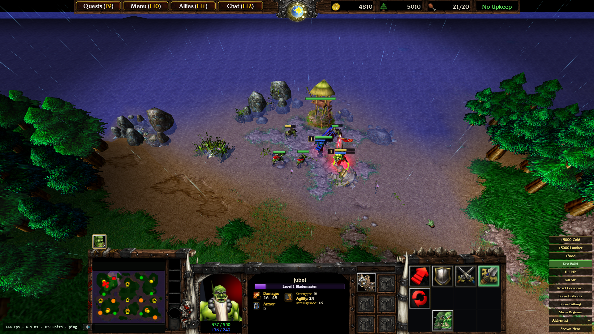

# OpenWar3



A browser-first recreation of the **Warcraft III: The Frozen Throne (1.27a)** engine in TypeScript. Ships **zero Blizzard assets** — uses your own install at runtime.

Goal: liberate WC3 from legacy constraints. Modern features planned:

- **Multiplayer reconnect** — no more dropped games lost
- **Better animation processing** — smoother than original
- **Cross-platform** — Windows, Linux, macOS, anything with a browser

Contributions welcome.

## Quick start

```bash
pnpm install
pnpm dev           # http://localhost:5173
pnpm build         # typecheck + build to dist/
```

## Legal

OpenWar3 is original code with zero copyrighted assets. Assets read from your local install, client-side, never uploaded or hosted. Engine fully open.

Licensed under the [MIT License](LICENSE).
