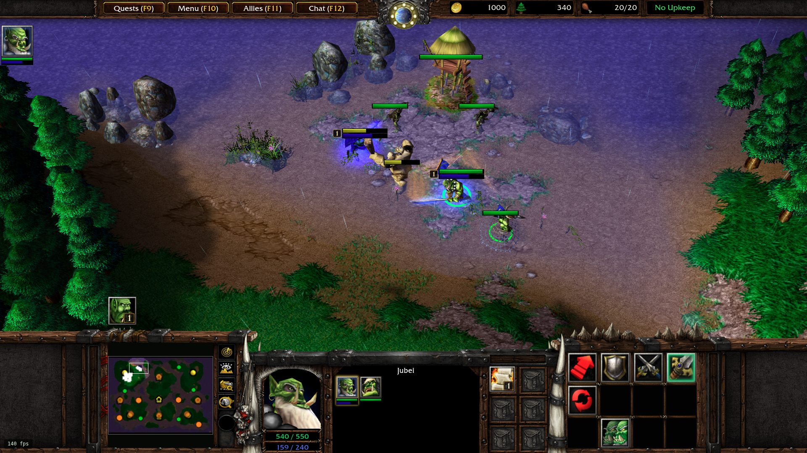
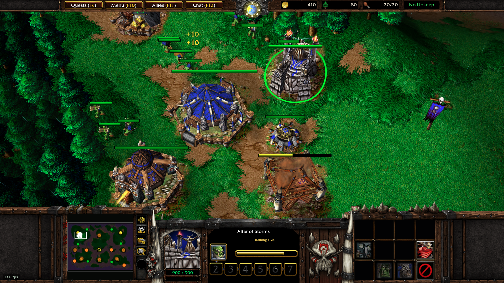

# OpenWar3




A recreation of the **Warcraft III** engine in TypeScript. Ships **zero Blizzard assets** — uses your own install at runtime.

**The Frozen Throne 1.30.4 is required**, and the game checks it. Every unit's stats, every
ability, every cost and timing is read out of each player's own install, so two people on
different patches would be playing different games — the host would resolve an order against its
Footman while the client drew the one in its own tables, and nothing in the network protocol could
catch it. So the version is a gate rather than a recommendation: an install that is not 1.30.4 is
refused with a message naming what it found, at the folder dialog and again at **every launch**
(the desktop app remembers your folder, and Warcraft III can be patched between one session and
the next). Pre-1.30 MPQ-era installs are older than that build by construction and are not
accepted.

Goal: liberate WC3 from legacy constraints and bring the engine up to modern standards. Features planned:

- **Cross-platform** — Windows, Linux, macOS, anything with a browser
- **Multiplayer reconnect** — no more dropped games lost
- **Better AI** — **Computer+**, a second melee AI beside Blizzard's own: friendlier to newer
  players, and it never cheats at any difficulty. Tick it in Advanced Options ([how it works](docs/computer-plus.md))
- **Huge control groups** — dozens of units can be added to a single control group
- **Select army hotkey** — select all combat units with a single hotkey (-)
- **Voice control accessibility mode** — a gameplay option that allows people with disabilities to enjoy the game
- **Voice chat in multiplayer** — push-to-talk voice chat implemented like in other games like DotA
  
Contributions welcome.

## Quick start

```bash
pnpm install
pnpm dev           # http://localhost:5173
pnpm build         # typecheck + build to dist/
```

### The desktop app

```bash
pnpm build && pnpm app
```

One window, one process. It asks for your Warcraft III folder **once** and remembers it — every
launch after that goes straight to the menu — and it reads that folder off your disk rather than
through the browser's picker, so there is no permission dance and no storage quota. Nothing is
uploaded, and nothing about your install is reachable from the network: the app reads it over a
scheme of its own that exists only inside the process, never over the port it serves the game on.

It is also the host: starting it starts the relay, so a LAN game needs no terminal and no second
command — see [Playing on a LAN](#playing-on-a-lan).

Packaged builds:

```bash
pnpm dist:linux    # release/OpenWar3-<version>.AppImage
pnpm dist:win      # release/… .exe   (NSIS installer)
pnpm dist:mac      # release/… .dmg
```

**The AppImage does not go in your Warcraft III folder** — put it anywhere. It asks where the game
is on first run and remembers, so the two are unrelated on disk. It will only accept a 1.30.4
folder, and re-checks it every launch.

The desktop app **checks this repo's releases at launch** and asks, in the game's own message box,
whether to fetch a newer version. Saying yes puts up the game's own load bar — a screen you cannot
leave, since the build under you is about to be replaced — and it downloads, installs and restarts
into the new version by itself. Saying no leaves you on the build you have, and the offer comes
back next launch.

To cut a release, tag the version in `package.json` and:

```bash
GH_TOKEN=<a token with repo scope> pnpm release
```

That builds and uploads the artifacts **plus the `latest-*.yml` beside them**, which is what the
updater actually reads — a release with the AppImage hand-uploaded and no metadata file is
invisible to it. macOS auto-update additionally needs an Apple developer signature; unsigned mac
builds install by hand.

### Playing on a LAN

Two machines on the same network, no cloud and no accounts.

**With the desktop app, nobody types anything.** Run it on both machines and pick **Local Area
Network** on each. Each copy announces itself on the subnet and listens for the others, so a game
created on one appears in the other's list within a couple of seconds — the way Warcraft III's own
LAN games always did. Either player can create the game; whoever does runs the authoritative
simulation, and the other joins it.

A machine the broadcast cannot reach — a different subnet, a network that drops broadcast traffic —
is added by hand instead. The host's game lobby prints the address to type, in the band between the
bottom panels (click it to copy); the joiner adds it under **Servers List**, the button above
Create Game. Addresses you add are kept and retried, so it is fine to add one before the other
player has started their game: the row waits, and their games appear when they do. Machines found
by broadcast are listed too, marked *(on your network)*.

**From a checkout**, one machine serves the page and the relay together:

```bash
pnpm dev --host
```

The other opens `http://<that machine's ip>:5173`. `--host` matters: without it the dev server
binds to that machine only, and nothing it hosts can be seen by anybody. The LAN screen says so
outright — that is the one failure that is otherwise invisible, since the far end just sees an
empty list.

**Firewall.** The desktop app wants two ports on the local network: **TCP 8787**, which carries
both the page and the game, and **UDP 8788**, which is only the "here I am" broadcast. Blocking
the UDP one costs you automatic discovery and nothing else — Servers List still works. From a
checkout it is TCP 5173 instead, and there is no broadcast at all.

On Windows and macOS the first launch raises the system's own "allow incoming connections?"
prompt — say yes for **private** networks. On Linux:

```bash
sudo ufw allow 8787/tcp && sudo ufw allow 8788/udp
```

The game cannot see through your firewall, so if the address is shown and nobody can reach it,
that rule is the thing to check. See [docs/multiplayer.md](docs/multiplayer.md) for how the
authority is split, and for the internet deployment.

## Legal

OpenWar3 is original code with zero copyrighted assets. Assets read from your local install, client-side, never uploaded or hosted. Engine fully open.

Licensed under the [MIT License](LICENSE).
