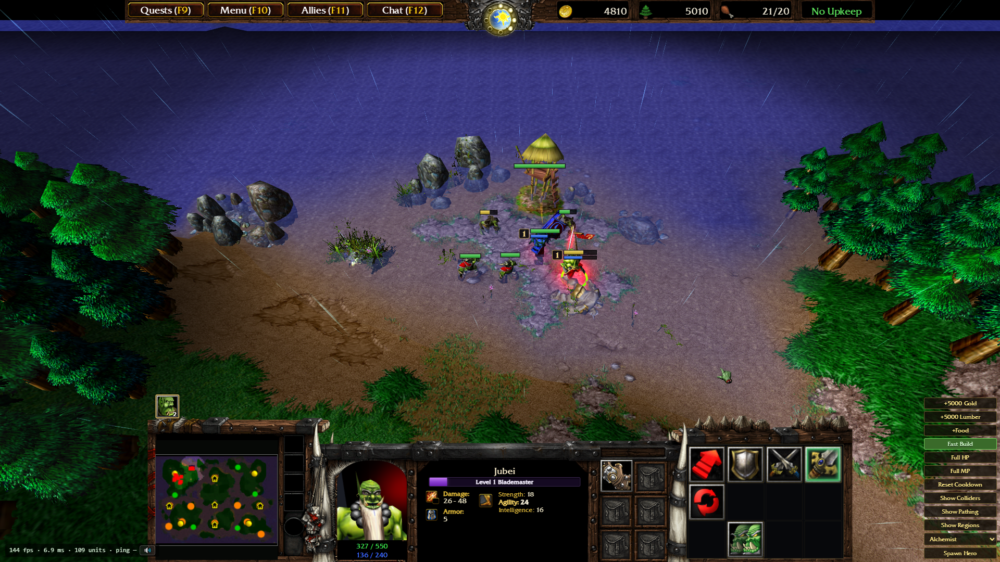

# OpenWar3



A recreation of the **Warcraft III** engine in TypeScript. Ships **zero Blizzard assets** — uses your own install at runtime. **The Frozen Throne 1.30.4** is the recommended version — it is what OpenWar3 targets, and its CASC content store is the storage the engine is built around. Older MPQ-era installs still mount, but are supported only on a best-effort basis.

Goal: liberate WC3 from legacy constraints and bring the engine up to modern standards. Features planned:

- **Cross-platform** — Windows, Linux, macOS, anything with a browser
- **Multiplayer reconnect** — no more dropped games lost
- **Better AI** — **Computer+**, a second melee AI beside Blizzard's own: friendlier to newer
  players, and it never cheats at any difficulty. Tick it in Advanced Options ([how it works](docs/computer-plus.md))
- **Huge control groups** — dozens of units can be added to a single control group
- **Select army hotkey** — select all combat units with a single hotkey (-)
- **Voice control accessibility mode** — a gameplay option that allows people with disabilities to enjoy the game
- **Voice chat in multiplayer** — push-to-talk voice chat implemented like in other games like DotA
  
Contributions welcome.

## Quick start

```bash
pnpm install
pnpm dev           # http://localhost:5173
pnpm build         # typecheck + build to dist/
```

## Legal

OpenWar3 is original code with zero copyrighted assets. Assets read from your local install, client-side, never uploaded or hosted. Engine fully open.

Licensed under the [MIT License](LICENSE).
